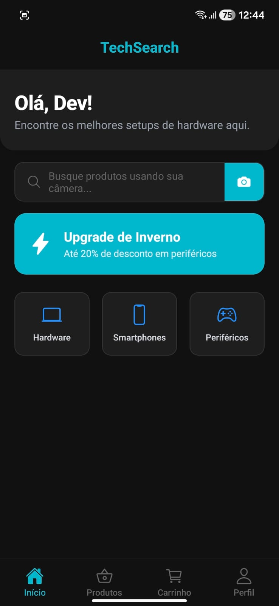
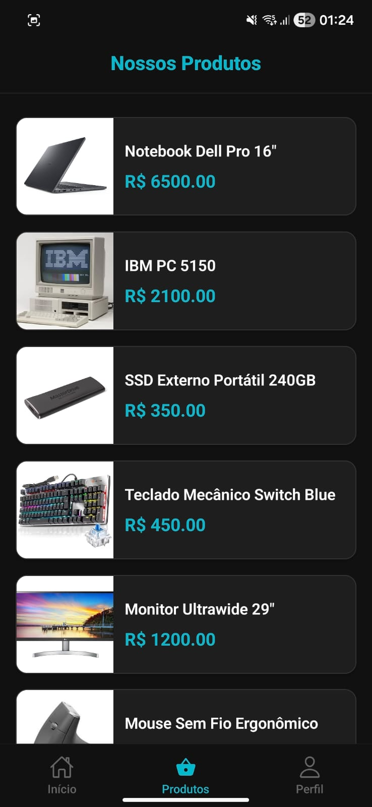
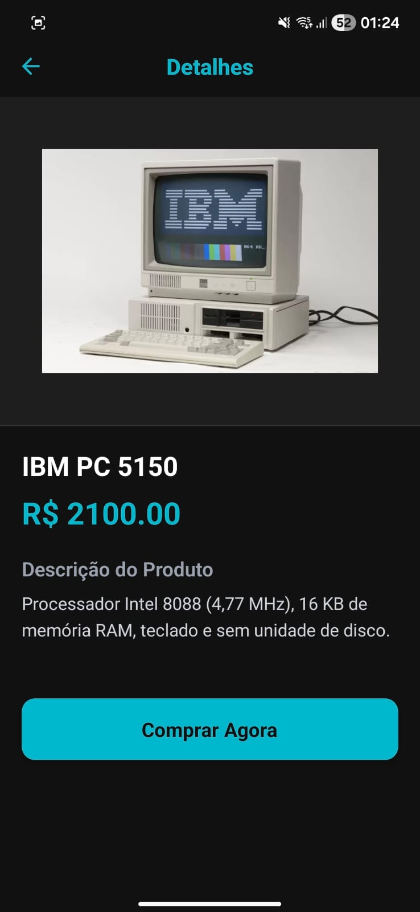
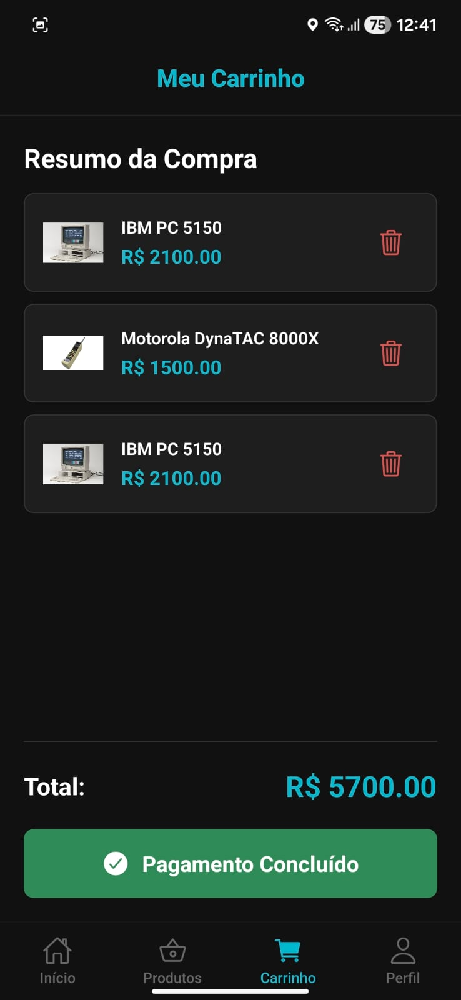
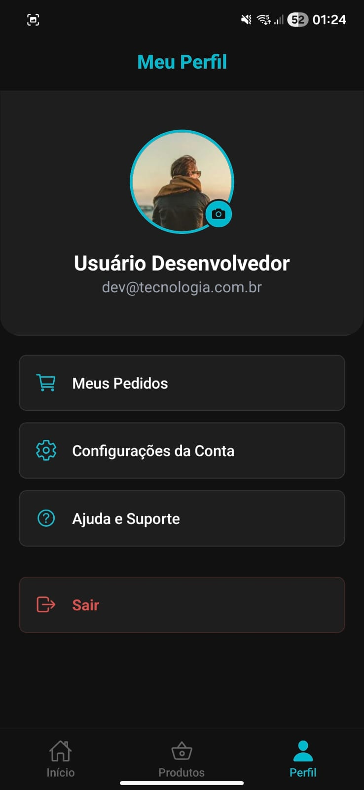
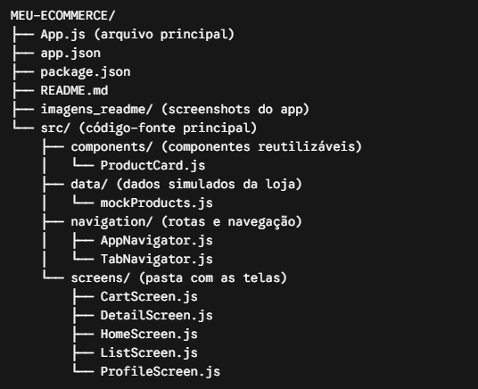
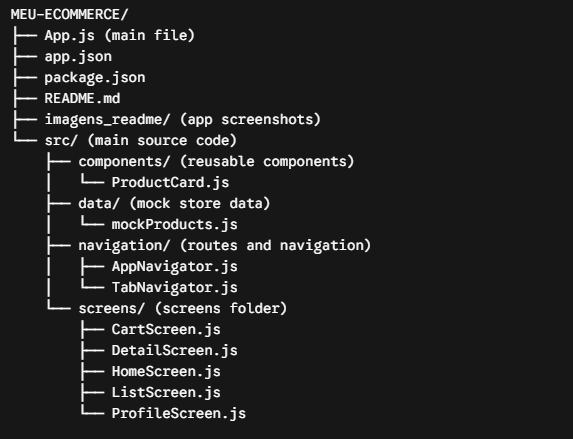

# TechSearch Mobile - E-Commerce App

## 🎓 Alunos Envolvidos:
   01847870 - Bruno José Silva de Lima
   01855540 - Guilherme Bernardino Fernandes de Oliveira
   01849774 - João Victhor dos Santos Silva 
   01846088 - Kauã Henrique Marques da Silva
   01888929 - Nícolas Tenório dos Santos de Lima
   01839709 - Thiago Romero Ferres Gomes de Lima

Instituição: Uninassau - Graças (Recife, PE)

Curso: Ciência da Computação - Noite (GRA0790103NNB)

Disciplina: Programação - Mobile Coding

Professor: Diogo Francisco Borba Rodrigues

[](#-versão-em-português)
[](#-english-version)

---

## pt-br Versão em Português

### Visão Geral do Projeto
O **TechSearch** é uma aplicação mobile de e-commerce voltada para o comércio de hardware, smartphones e periféricos. O projeto adota uma interface moderna baseada no padrão *Dark Mode*, priorizando uma experiência de usuário (UX) fluida e de alto contraste. O sistema integra navegação hierárquica e a utilização de sensores nativos do dispositivo móvel para simular um ambiente de compras funcional e seguro.

### Principais Funcionalidades
* **Interface Moderna e Responsiva:** Estilização desenvolvida via StyleSheet com paleta de cores unificada em Dark Mode (`#111111` e `#00b8cc`).
* **Catálogo de Produtos:** Listagem dinâmica e otimizada de produtos através do componente `FlatList`.
* **Sistema de Filtros:** Navegação baseada em parâmetros para filtragem eficiente entre categorias (Hardware, Smartphones e Periféricos).
* **Arquitetura de Navegação:** Implementação combinada de `Bottom Tab Navigator` para as sessões principais e `Stack Navigator` para o fluxo de checkout e detalhes.
* **Detalhamento de Entidades:** Visualização aprofundada de produtos com tráfego de dados via parâmetros de rota.
* **Gestão de Perfil:** Interface de usuário com suporte para upload e atualização de imagem de avatar.
* **Fluxo de Pagamento Seguro:** Simulação de carrinho de compras condicionada à autenticação do usuário em nível de sistema operativo.

### Stack Tecnológico
* [React Native](https://reactnative.dev/)
* [Expo](https://expo.dev/)
* [React Navigation](https://reactnavigation.org/) (Stack & Bottom Tabs)
* JavaScript / ES6+

### Integrações de Hardware e APIs Nativas
* **Câmera e Sistema de Arquivos (`expo-image-picker`):** Implementada na tela inicial (simulação de busca computacional por imagem) e na tela de Perfil (acesso à galeria do dispositivo para personalização de avatar).
* **Autenticação Biométrica (`expo-local-authentication`):** Exigência de validação via biometria (Face ID ou Impressão Digital nativos do aparelho) como etapa de segurança para a conclusão de transações no carrinho de compras.

### Guia de Instalação e Execução

1. Realize o clone deste repositório para o seu ambiente local.
2. Acesse o diretório do projeto via terminal e instale as dependências:
   
   ```npm install```

3. Inicialize o servidor de desenvolvimento:
   
   ```npx expo start```

4. Utilize o aplicativo Expo Go em seu dispositivo móvel para escanear o QR Code gerado e executar a aplicação.

### 📸 Screenshots do App Funcionando

<p align="center">
  
  
  
  
  
</p>

### </> Estrutura Básica do Projeto

<p align="center">
  
</p>

## 🇺🇸 English Version

# TechSearch Mobile - E-Commerce App

### Project Overview
**TechSearch** is a mobile e-commerce application focused on hardware, smartphones, and peripherals. The project adopts a modern *Dark Mode* interface, prioritizing a fluid, high-contrast user experience (UX). The system integrates hierarchical navigation and utilizes native mobile hardware sensors to simulate a functional and secure shopping environment.

### Key Features
* **Modern & Responsive UI:** StyleSheet-based design unified under a Dark Mode color palette (`#111111` and `#00b8cc`).
* **Product Catalog:** Optimized and dynamic rendering of products using the `FlatList` component.
* **Filtering System:** Parameter-based navigation for efficient filtering between categories (Hardware, Smartphones, and Peripherals).
* **Navigation Architecture:** Combined implementation of `Bottom Tab Navigator` for primary sections and `Stack Navigator` for the checkout and detail flows.
* **Entity Detailing:** In-depth product view utilizing route parameter data passing.
* **Profile Management:** User interface supporting avatar image upload and update.
* **Secure Payment Flow:** Shopping cart simulation strictly conditioned to user authentication at the operating system level.

### Tech Stack
* [React Native](https://reactnative.dev/)
* [Expo](https://expo.dev/)
* [React Navigation](https://reactnavigation.org/) (Stack & Bottom Tabs)
* JavaScript / ES6+

### Hardware Integrations & Native APIs
* **Camera & File System (`expo-image-picker`):** Implemented on the Home Screen (simulating computational image search) and Profile Screen (device gallery access for avatar customization).
* **Biometric Authentication (`expo-local-authentication`):** Mandatory validation via native biometrics (Face ID or Fingerprint) as a security measure to authorize transactions within the shopping cart.

### Installation & Setup Guide

1. Clone this repository to your local environment.
2. Navigate to the project directory via terminal and install dependencies:
   
   ```npm install```
3. Start the development server:
   
   ```npx expo start```

4. Use the Expo Go application on your mobile device to scan the generated QR Code and launch the app.

### 📸 Visual Demonstration

<p align="center">
  
  
  
  
  
</p>

### </> Basic Project Structure

<p align="center">
  
</p>